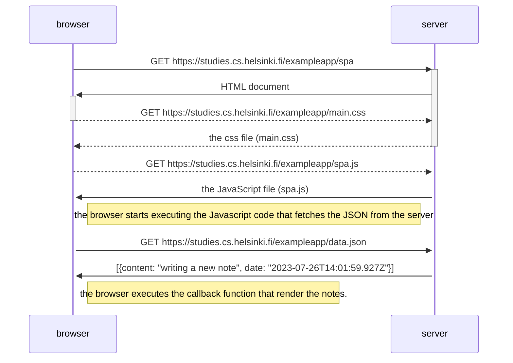

```mermaid
sequenceDiagram
    browser->>+server: GET https://studies.cs.helsinki.fi/exampleapp/spa
    server->>+browser: HTML document
    browser-->>-server: GET https://studies.cs.helsinki.fi/exampleapp/main.css
    server-->>-browser: the css file (main.css)
    browser-->>+server: GET https://studies.cs.helsinki.fi/exampleapp/spa.js
    server->>+browser: the JavaScript file (spa.js)
    Note right of browser: the browser starts executing the Javascript code that fetches the JSON from the server
    browser->>+server: GET https://studies.cs.helsinki.fi/exampleapp/data.json
    server->>+browser: [{content: "writing a new note", date: "2023-07-26T14:01:59.927Z"}]
    Note right of browser: the browser executes the callback function that render the notes.
```
