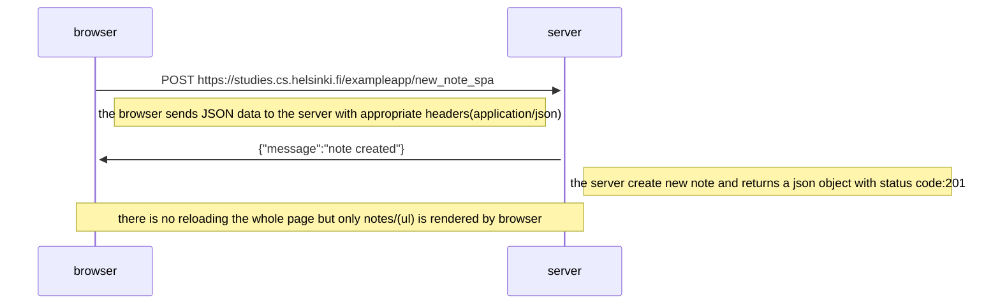

```mermaid
sequenceDiagram
    browser->>+server: POST https://studies.cs.helsinki.fi/exampleapp/new_note_spa
    Note right of browser: the browser sends JSON data to the server with appropriate headers(application/json)
    server->>+browser:  {"message":"note created"}
    Note right of server: the server create new note and returns a json object with status code:201
    Note over browser,server: there is no reloading the whole page but only notes/(ul) is rendered by browser

```
